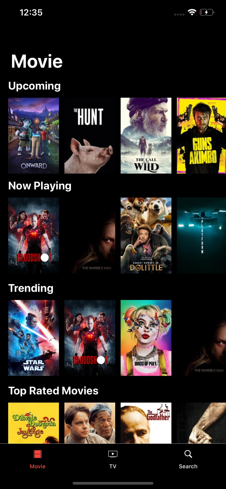
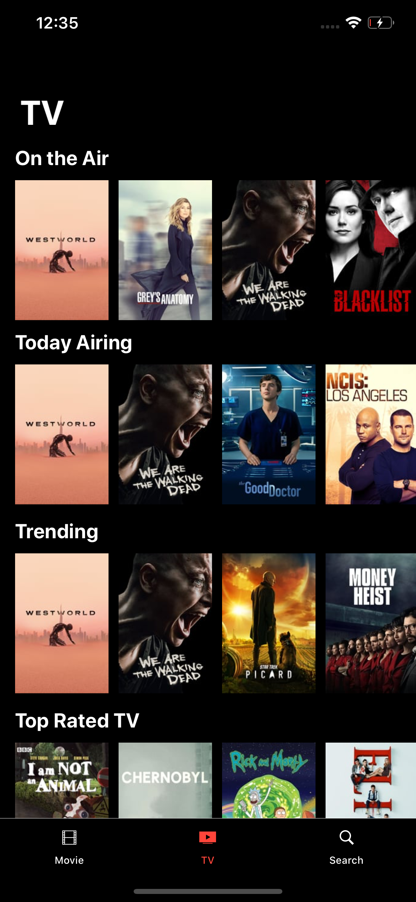
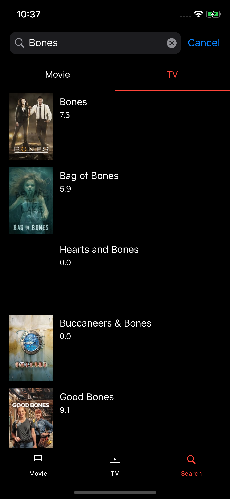
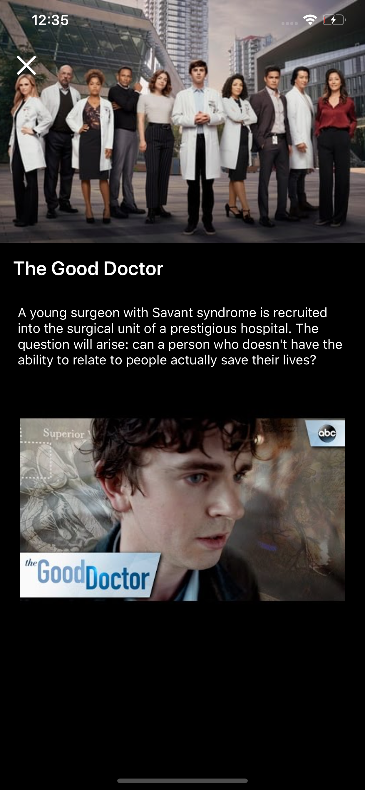
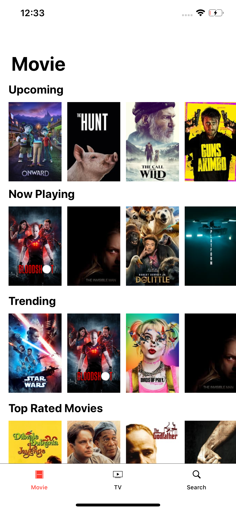
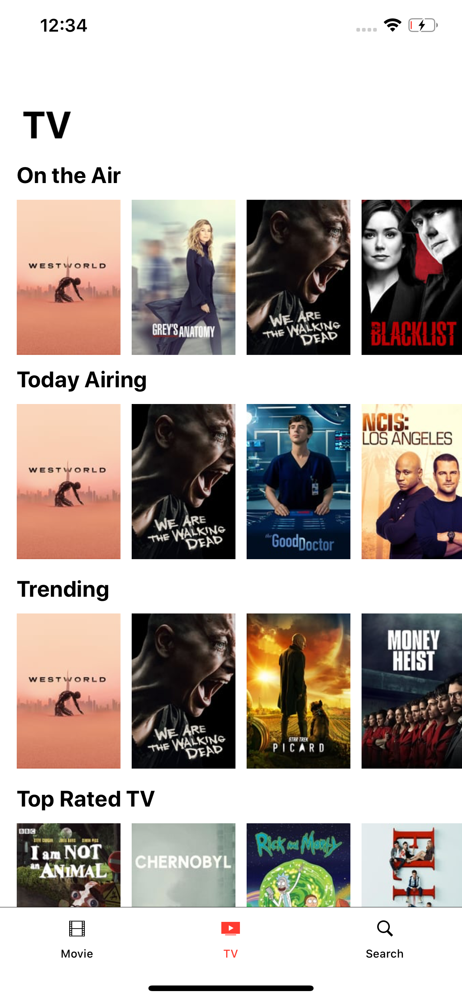
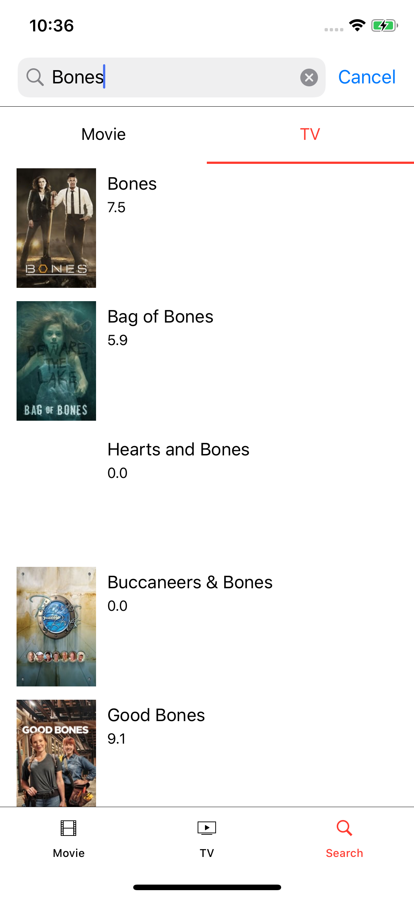
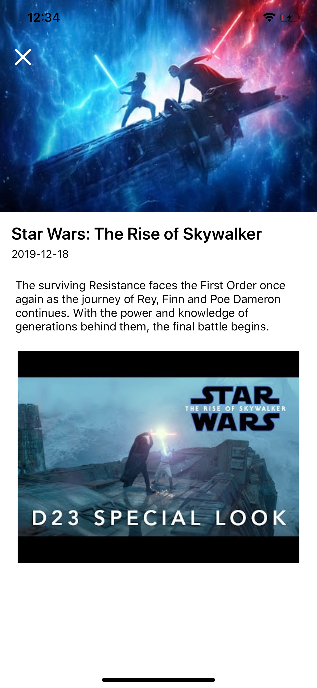

# MovieNow

### Screen

   

   

### Usage

* [MovieDB API](https://developers.themoviedb.org/3)

### References

* [MVC with sugar](https://github.com/insidegui/mvcwithsugar)
* [MVC Todo](https://github.com/davedelong/MVCTodo)
* [Clean Architecture and MVVM on iOS](https://tech.olx.com/clean-architecture-and-mvvm-on-ios-c9d167d9f5b3)
